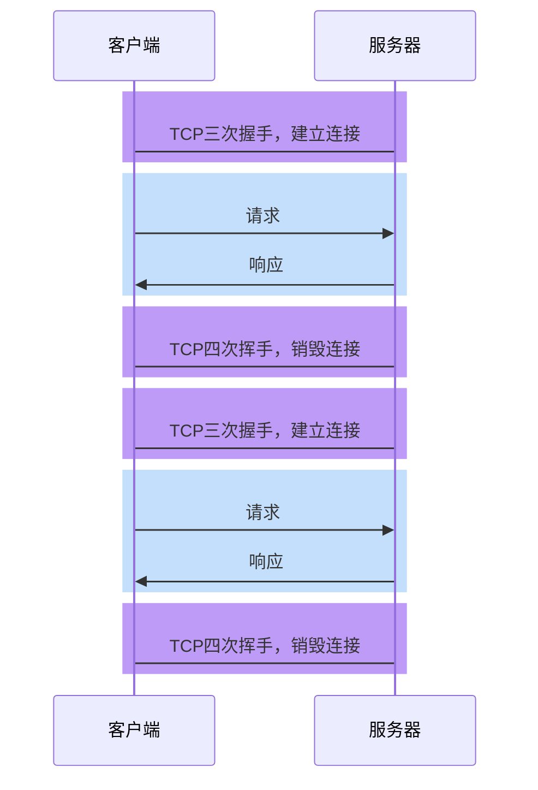

# http请求

一次网络请求包含请求行，请求头，请求体

请求行

```html
GET /index.html HTTP/1.1
```

请求头

```html
Accept: */* Accept-Encoding: gzip, deflate, br, zstd Accept-Language:
zh-CN,zh;q=0.9 Cache-Control: no-cache Connection: keep-alive
```

请求体（浏览器中叫荷载）

```html
{"name":"client_recommends","value":"测试"}
```

## 请求方法(get与post)

**请求方法是请求行中的第一个单词**，它向服务器描述了客户端发出请求的动作类型。在 HTTP 协议中，不同的请求方法只是包含了不同的语义，但服务器和浏览器的一些约定俗成的行为造成了它们具体的区别


在实践中，**客户端和服务器**慢慢的形成了一个共识，约定俗成的规定了一些常见的请求方法：

- GET，表示向服务器获取资源。业务数据在请求行中，无须请求体
- POST，表示向服务器提交信息，通常用于产生新的数据，比如注册。业务数据在请求体中
- PUT，表示希望修改服务器的数据，通常用于修改。业务数据在请求体中
- DELETE，表示希望删除服务器的数据。业务数据在请求行中，无须请求体。
- OPTIONS，发生在跨域的预检请求中，表示客户端向服务器申请跨域提交
- TRACE，回显服务器收到的请求，主要用于测试和诊断
- CONNECT，用于建立连接管道，通常在代理场景中使用，网页中很少用到

## GET 和 POST 的区别

**由于浏览器和服务器约定俗称的规则**，造成了 GET 和 POST 请求在 web 中的区别

1. 浏览器在发送 GET 请求时，不会附带请求体
2. GET 请求的传递信息量有限，适合传递少量数据；POST 请求的传递信息量是没有限制的，适合传输大量数据。
3. GET 请求只能传递 ASCII 数据，遇到非 ASCII 数据需要进行编码；POST 请求没有限制
4. 大部分 GET 请求传递的数据都附带在 path 参数中，能够通过分享地址完整的重现页面，但同时也暴露了数据，若有敏感数据传递，不应该使用 GET 请求，至少不应该放到 path 中
5. 刷新页面时，若当前的页面是通过 POST 请求得到的，则浏览器会提示用户是否重新提交。若是 GET 请求得到的页面则没有提示。
6. GET 请求的地址可以被保存为浏览器书签，POST 不可以

## http请求报错

一种情况是返回200，但参数里附带着code=0或者code=500来表示请求有没有通过（成功访问或者没有成功访问），无论哪种都是这次http请求返回的状态码是200，只是内容不同而已

# http状态码和含义

- 100-199 用于指定客户端应相应的某些动作。
- 200-299 用于表示请求成功。
- 300-399 用于已经移动的文件并且常被包含在定位头信息中指定新的地址信息。
- 400-499 用于指出客户端的错误。

400 语义有误，当前请求无法被服务器理解。

401 当前请求需要用户验证

403 服务器已经理解请求，但是拒绝执行它。

- 500-599 用于支持服务器错误。

503 – 服务不可用

# http版本

## HTTP1.0

### 无法复用连接

HTTP1.0为每个请求单独新开一个TCP连接



由于每个请求都是独立的连接，因此会带来下面的问题：

1.  连接的建立和销毁都会占用服务器和客户端的资源，造成内存资源的浪费
2.  连接的建立和销毁都会消耗时间，造成响应时间的浪费
3.  无法充分利用带宽，造成带宽资源的浪费

> TCP协议的特点是「慢启动」，即一开始传输的数据量少，一段时间之后达到传输的峰值。而上面这种做法，会导致大量的请求在TCP达到传输峰值前就被销毁了

### 队头阻塞


## HTTP1.1

### 长连接

为了解决HTTP1.0的问题，**HTTP1.1默认开启长连接**，即让同一个TCP连接服务于多个请求和响应。


在这种情况下，多次请求响应可以共享同一个TCP连接，这不仅减少了TCP的握手和挥手时间，同时可以充分利用TCP「慢启动」的特点，有效的利用带宽。

> 实际上，在HTTP1.0后期，虽然没有官方标准，但开发者们慢慢形成了一个共识：
>
> 只要请求头中包含Connection:keep-alive，就表示客户端希望开启长连接，希望服务器响应后不要关闭TCP连接。如果服务器认可这一行为，即可保持TCP连接。
>
> 在http1.1里默认使用长连接，加不加这个请求头都无所谓

当需要的时候，任何一方都可以关闭TCP连接

> 连接关闭的情况主要有三种：
>
> 1. 客户端在某一次请求中设置了`Connection:close`，服务器收到此请求后，响应结束立即关闭TCP
> 2. 在没有请求时，客户端会不断对服务器进行心跳检测（一般每隔1秒）。一旦心跳检测停止，服务器立即关闭TCP
> 3. 当客户端长时间没有新的请求到达服务器，服务器会主动关闭TCP。运维人员可以设置该时间。

由于一个TCP连接可以承载多次请求响应，并在一段时间内不会断开，因此这种连接称之为长连接。


一个连接ID就是一个TCP连接

### 管道化和队头阻塞

HTTP1.1允许在响应到达之前发送下一个请求，这样可以大幅缩减带宽限制时间

**但这样做会存在队头阻塞的问题**

这种模式叫管道化


由于多个请求使用的是同一个TCP连接，**服务器必须按照请求到达的顺序进行响应**导致了一些后发出的请求，无法在处理完成后响应，产生了等待的时间，而这段时间的带宽可能是空闲的，这就造成了带宽的浪费

队头阻塞虽然**发生在服务器**，但这个问题的根源是客户端无法知晓服务器的响应是针对哪个请求的。

正是由于存在队头阻塞，我们常常使用下面的手段进行优化：

- 通过减少文件数量，从而减少队头阻塞的几率
- 通过开辟多个TCP连接，实现真正的、有缺陷的并行传输

> 浏览器会根据情况，为打开的页面自动开启TCP连接，对于同一个域名的连接最多6个
>
> 如果要突破这个限制，就需要把资源放到不同的域中

然而，管道化并非一个成功的模型，它带来的队头阻塞造成非常多的问题，所以现代浏览器默认是关闭这种模式的

还是一个接着一个的请求方式

## HTTP2.0


> 有了http2以后，雪碧图已经没有意义

http2必须运行https（安全协议之上）

### 二进制分帧

HTTP2.0可以允许以更小的单元传输数据，每个传输单元称之为**帧**，而每一个请求或响应的完整数据称之为**流**，每个流有自己的编号，每个帧会记录所属的流。

比如，服务器连续接到了客户端的两个请求，一个请求JS、一个请求CSS，两个文件如下：

js文件

```javascript
function a() {}
function b() {}
```

css文件

```css
.container {
}
.list {
}
```

最终形成的帧可能如下


可以看出，每个帧都带了一个头部，记录了流的ID，这样做就能够准确的知道这一帧数据是属于哪个流的。

> 同一个流下，一定是按顺序传输的


发送的时候，按帧发送，接收的时候也是按帧接收，由于每一帧都会表明是哪个流，这样就真正的解决了共享TCP连接时的队头阻塞问题，实现了真正的**多路复用**

**不同的流之间是可以随便传的，但同一个流之间只能按顺序发送**

不仅如此，由于传输时是以帧为单元传输的，无论是**响应还是请求**，都可以实现并发处理，即不同的传输可以交替进行。

由于进行了分帧，还可以设置传输优先级。

### 头部压缩

HTTP2.0之前，所有的消息头都是以字符的形式完整传输的

可实际上，大部分头部信息都有很多的重复

为了解决这一问题，HTTP2.0使用头部压缩来减少消息头的体积


由于http2有官方的静态表，而且静态表约定的内容已经确定，所以说只需要发送对应的编号就可以

对于两张表都没有的头部，则使用Huffman编码压缩后进行传输，同时添加到动态表中，第一次发送的完整数据，后面就不会再发了，而是发送动态表里的


这是一个http2的头部

带冒号的头部就是他新增的，来自静态表

method以前在请求行，在http2中没有请求行，把他放入了请求体中

加冒号是为了重名，为了防止和之前的重复

### 服务器推

HTTP2.0允许在客户端没有主动请求的情况下，服务器预先把资源推送给客户端

当客户端后续需要请求该资源时，则自动从之前推送的资源中寻找

比如你就只请求了一个www.baidu.com,但是他把css,js都同时推给你了，因为他觉得你后面肯定会用到

# https

## SSL、TLS、HTTPS的关系

SSL（Secure Sockets Layer），安全套接字协议

TLS（Transport Layer Security），传输层安全性协议

**TLS是SSL的升级版，两者几乎是一样的，他们两者都是为了保证传输安全**

HTTPS（Hyper Text Transfer Protocol over SecureSocket Layer），建立在SSL协议之上的HTTP协议


http与https之间的不同就是https多了一个ssl,tls（证书验证的过程）

http是一种不安全的传输方式，你看见的网页不一定是浏览器发送给你的原文，你发送给服务器的原文，服务器可能接受到的东西也不是这样

为什么呢？

1.明文传输，直接拦截篡改


2.对称加密传输


中间攻击人也能拿到对称密钥

3.采用非对称加密


刚开始服务器发给浏览器一个公钥，然后服务器生成一个密钥key1，用公钥加密传输，由于只有服务器有私钥，中间攻击人不可能得到key2，之后都可以采用key2密钥加密。


但这样还是有问题，当服务器发出公钥的时候，攻击者就可以进行拦截，由此以后，攻击者还是可以拿到key2密钥

### 证书颁发机构

一切做法都无法达到，必须要依靠第三方，全世界都必须要信任

ca:证书颁发机构

需要花钱购买证书，证书会绑定到域名(最早的时候证书与域名没有关系，现在tls升级之后可以跟域名绑定，而且3级域名每一个域名都可以绑定一个证书)

给机构三样东西：钱，域名，生成一对公钥私钥（公钥给他）

机构给你颁发一个证书


机构有自己的公钥与私钥：公钥全世界发，私钥不会泄漏


证书的组成部分

1.你的域名

2.证书颁发机构

3.加密的你发给他的公钥信息（私钥加密）

4.加密的证书签名（私钥加密）

这两个地方的私钥都可以用公钥解密

这样就可以防止黑客了，因为你一旦变动了机构发给他的3与4，那么对方就无法解密，一旦无法解密就能知道密钥被篡改过

证书签名的组成

1.域名

2.证书机构公钥key

3.自己发给机构的key

由于

由于有签名的存在，以至于黑客也无法改动域名和证书机构


有此情况，证书无法被伪造，所以服务器只需要验证证书签名即可验证信息发送的有无被篡改


### ssl与tls的关系

TLS是SSL的后续版本

TLS是SSL的后续版本，两者在功能上相似，但TLS在安全性方面有所改进。
